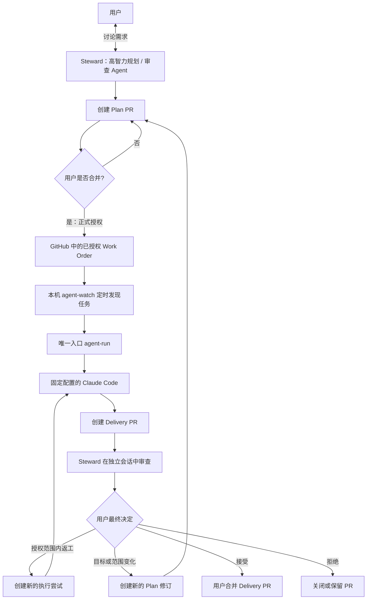

# Agent Delivery Loop

> 一个 GitHub-native、由人类明确授权的 CLI Coding Agent 持续交付闭环。

**English summary:** A GitHub-native, human-authorized delivery loop for CLI coding agents.

> [!IMPORTANT]
> 本项目目前处于**协议与架构设计阶段**。仓库中尚无可运行的执行器，也不应被视为可用于生产环境的自动化系统。

## 为什么要做这个项目

Coding Agent 已经可以完成大量开发工作，但“能够写代码”并不等于“可以长期、无人值守地交付代码”。真正困难的问题包括：

- Agent 从哪里获得经过确认的任务？
- 怎样证明它执行的是用户批准的那个版本？
- 怎样防止任务在执行过程中悄悄扩大范围？
- 怎样让不同触发入口最终遵守同一套规则？
- 怎样在不绑定某个特定 Agent 框架的前提下保留审查、追踪和恢复能力？
- 怎样确保 Agent 只能提交候选成果，而不能自行批准、合并或部署？

Agent Delivery Loop 的第一阶段只解决一个明确目标：

> 将已经讨论清楚并获得人类授权的需求，安全地交给本地 CLI Agent 执行，并通过 GitHub 返回可审查的交付成果。

“主动发现问题并推动项目长期演进”属于后续阶段，不在 v0 范围内。

## 核心原则

1. **GitHub 是事实来源**

   任务、授权、代码、审查意见和最终结果都以 GitHub 中可追踪的记录为准。

2. **人类授权与代码验收是两个不同决定**

   - 合并 Plan PR：允许 Agent 开始工作。
   - 合并 Delivery PR：接受 Agent 交付的代码。

3. **所有触发入口最终调用同一个执行入口**

   无论任务来自定时轮询、手动命令，还是未来的 Hermes，都只能请求执行一个确定的任务引用：

   ```text
   agent-run <task-reference>
   ```

   `agent-run` 是拟议命令，目前尚未实现。

4. **提示词和 Skill 负责指导，确定性程序负责约束**

   Agent 可以通过 Skill 理解工作方法，但权限、超时、工作目录、允许修改的范围以及禁止自动合并等规则，必须由外部执行器检查。

5. **执行 Agent 是可替换的工作人员，不是任务所有者**

   Agent 可以修改代码、运行构建并提交 Delivery PR，但不能修改已授权的任务目标，也不能批准自己的成果。

6. **失败应当可见，而不是被自动掩盖**

   模型、供应商或执行环境发生故障时，本次执行应明确失败。v0 不会在同一次运行中偷偷切换模型继续工作。

## v0 工作流程

这里的 **Work Order** 是合并进主分支、可被程序读取的任务授权记录。执行器必须绑定 Plan PR 的 merge commit、Work Order 修订版本和内容摘要，不能在启动时随意读取一个后来被改过的“最新版”。



`agent-watch` 与 `agent-run` 是计划中的组件，尚未实现。合并 Plan PR 只代表任务获得执行资格；实际启动时间取决于本机下一次轮询。

这个流程包含两道明确的门：

```text
第一道门：允许开始施工
Plan PR ──用户合并──> Agent 获得执行资格

第二道门：接受施工结果
Delivery PR ──用户合并──> 代码进入正式分支
```

## 五分钟理解双 PR

- **仓库（Repository）**：项目文件以及完整修改历史。
- **主分支（通常是 `main`）**：当前正式版本。
- **分支（Branch）**：从正式版本分出的一条独立修改线，Agent 可以在其中工作而不立即影响正式版本。
- **提交（Commit）**：一次有编号的修改快照。
- **PR（Pull Request）**：请求审查并合并某条分支的 GitHub 页面。
- **合并（Merge）**：批准 PR，把改动正式纳入目标分支。

“双 PR”不是让 Agent 写两遍代码，而是分开批准两个问题。

### Plan PR：任务授权单

Plan PR 不负责提交最终功能，而是记录 Agent 被允许完成什么工作。它至少应说明：

- 任务目标；
- 明确不做的内容；
- 验收条件；
- 允许修改的目录或文件；
- 执行器和固定运行配置；
- 使用的 Delivery Skill 版本；
- 超时、预算和停止条件；
- 任务所基于的代码版本。

当用户合并 Plan PR 时，代表：

> 我同意 Agent 按照这个精确版本的计划开始工作。

如果目标、验收条件、修改范围或 Skill 版本发生实质变化，应创建新的任务修订版本并重新授权。

### Delivery PR：实际交付物

Delivery PR 包含：

- Agent 实际修改的代码；
- 构建或检查结果；
- 任务执行摘要；
- 偏离计划之处；
- 未解决问题和风险。

Delivery PR 可以由高智力 Agent 审查，但最终是否合并仍由用户决定。

## v0 角色

### 用户 / Repository Owner

- 与 Steward 确认需求；
- 合并 Plan PR，授予执行权限；
- 处理 Agent 无法决定的问题；
- 最终合并或拒绝 Delivery PR。

### Steward：高智力规划与审查 Agent

- 与用户澄清需求；
- 将谈话整理为可执行的 Work Order；
- 创建或建议 Plan PR；
- 在交付后开启新的独立会话审查 Delivery PR；
- 发现越界、遗漏和风险。

Steward 可以提出建议，但不能替用户完成最终授权或合并。审查结论必须绑定 Delivery PR 的精确 head SHA；PR 出现新提交后，旧审查自动失效。

### Worker：执行层 Agent

v0 只支持一个固定配置的 Claude Code Worker。它负责：

- 读取已授权的 Work Order；
- 在独立 worktree 和新会话中工作；
- 修改允许范围内的代码；
- 运行必要的构建或检查；
- 创建 Delivery PR；
- 在无法安全继续时报告 `blocked`。

它不能扩大任务范围、修改授权记录、切换执行模型、合并 PR 或部署到生产环境。

### `agent-watch`：本地任务观察器

`agent-watch` 是计划中的轻量“门铃”：

- 定时查询 GitHub；
- 找到已经授权但尚未执行的任务；
- 避免重复领取同一个任务；
- 调用唯一入口 `agent-run`。

v0 优先采用本机轮询，因为它不要求公开本机端口，电脑离线期间也不会丢失 GitHub 中的任务。

### `agent-run`：唯一执行入口

`agent-run` 是计划中的确定性执行器：

- 验证任务和授权状态；
- 固定任务修订版本、代码基线和 Skill 版本；
- 创建隔离的 worktree；
- 启动固定配置的 Claude Code；
- 施加权限、范围、超时和并发限制；
- 收集结构化执行结果；
- 创建或更新 Delivery PR。

未来所有入口都只能请求调用它，不能各自实现一套执行逻辑。

### Hermes：可选的边缘遥控器

Hermes 不在 v0 执行主链中。未来它可以：

- 向手机发送 `REVIEW_READY`、`BLOCKED` 或执行失败通知；
- 查询 GitHub 上的任务状态；
- 在用户确认后，为已经通过 Plan PR 授权的精确 Work Order 版本发送唤醒或重试信号；
- 修改通知、唤醒等不代表授权的 GitHub 状态。

它不应该：

- 把手机中的自然语言直接转换为本机 Shell 命令；
- 保存代码仓库的生产密钥；
- 修改 Work Order 内容；
- 直接启动未经 GitHub 授权的任务；
- 通过标签、评论或手机确认代替 Plan PR 合并；
- 合并或部署代码。

可以把 Hermes 理解为“GitHub 遥控器和通知员”，而不是执行 Agent 或另一套调度中心。Hermes 的消息永远不是执行凭证；本地 `agent-run` 仍须重新验证 GitHub 中的授权。GitHub 始终保存正式任务和授权记录。

```text
Hermes 在手机上报告 WO-123/r1 执行失败
→ 用户要求重试这个已经授权的精确版本
→ Hermes 在 GitHub 留下唤醒信号
→ 本机执行器重新验证授权后运行
```

## v0 锁定范围

| 项目 | v0 决定 |
| --- | --- |
| 事实来源 | GitHub |
| 仓库与主机 | 一个仓库、一台受信任的本地主机 |
| Worker | 一个固定配置的 Claude Code |
| 并发 | 同一时间最多一个任务 |
| 运行隔离 | 每次使用新会话和独立 worktree |
| 最基础入口 | 手动调用拟议的 `agent-run` |
| 无人值守入口 | 拟议的 `agent-watch` 定时轮询 |
| 执行授权 | 用户合并 Plan PR |
| 成果验收 | Steward 审查，用户决定是否合并 Delivery PR |
| 自动合并 / 部署 | 不允许 |
| 模型路线 | 一次运行只使用一个固定模型和供应商 |

## v0 非目标

以下能力不会进入第一版主链：

- 通用 MCP 调度中心；
- CCSwitch 自动切换；
- 多模型动态路由；
- 执行过程中的模型故障转移；
- 多机器分布式调度；
- 大规模低成本 Agent 池；
- 自动合并或自动部署；
- 让 Hermes 直接控制本机命令；
- Agent 自主发现需求并决定项目方向；
- 无人监督的长期自我演进。

它们不是永远不做，而是需要在基础交付闭环稳定以后逐步引入。

## CCSwitch 的位置

CCSwitch 可以继续作为个人 Claude Code 环境中的模型与能力实验工具，但不进入 v0 的自动执行主链。

```text
日常交互环境
└── 可以使用 CCSwitch 探索模型、Skill 和 MCP

无人值守执行环境
└── 使用固定的 Claude Code 配置
    └── 一次运行中不切换模型或供应商
```

未来如果出现多机器、并发执行、统一密钥管理和集中成本统计需求，再评估统一中转服务。

## 计划中的仓库结构

```text
.
├── README.md
├── LICENSE
├── docs/
│   ├── architecture.md
│   ├── threat-model.md
│   └── decisions/
├── .agents/
│   ├── protocol/
│   │   ├── work-order.schema.json
│   │   └── result.schema.json
│   ├── policies/
│   │   └── delivery-skill/
│   ├── work-orders/
│   └── runs/
├── bin/
│   ├── agent-watch
│   └── agent-run
├── templates/
│   ├── plan-pr.md
│   └── delivery-pr.md
└── examples/
```

这只是目标结构，当前仓库尚未实现这些组件。

## 安全边界

由于本仓库公开，任何提交到仓库的内容都应被视为公开信息。不得提交：

- API Key、Token 或密码；
- 本机私有路径和个人信息；
- 私有仓库源码或内部业务数据；
- 未脱敏的完整 Agent 会话；
- 可被滥用的生产环境凭据。

外部用户提交的 Issue、评论和 PR 都是不可信输入。只有受信任维护者合并的 Plan PR 才能成为执行资格信号。本地执行器应使用最小权限凭据，且不应持有生产部署权限。

公开仓库至少应满足以下保护条件：

- `main` 启用分支保护并禁止强制推送；
- 只有受信任的人类账户可以合并 Plan PR；
- Worker 的凭据无权合并 Plan PR、修改保护规则或直接推送 `main`；
- `.agents/work-orders/` 与策略目录使用 CODEOWNERS 或等效保护；
- 持久化的本机 self-hosted runner 不直接执行来自 fork 的 `pull_request` 代码。

运行日志应默认只保存完成审查所需的信息，并对凭据、私有路径和个人信息进行脱敏。

## 仍需讨论的问题

在开始实现 v0 之前，还需要锁定：

- Work Order 的最小字段；
- 哪些低风险任务可以跳过独立 Plan PR；
- Plan PR 与任务 Issue 的关系；
- `agent-watch` 使用 `launchd`、cron 还是其他本地服务；
- GitHub 身份认证采用细粒度 Token 还是 GitHub App；
- 如何领取任务并避免重复执行；
- 中断、超时和重试规则；
- Claude Code 固定配置的隔离方式；
- Delivery Skill 的第一版内容；
- Worker 允许使用哪些现有 Skills、Hooks 和 MCP；
- 代码修改范围如何进行确定性检查；
- 哪些检查必须通过才能创建 Delivery PR；
- Steward 的选择和审查输出格式；
- Hermes 未来被允许执行的 GitHub 操作；
- 公开日志的脱敏和保留期限；
- 开源许可证。

## 当前状态

```text
阶段：设计
可运行代码：无
生产可用性：不可用
默认执行器：计划使用 Claude Code
许可证：待确定；源码公开但暂未授权复用
```

当前工作的重点是完成协议讨论、冻结 v0 边界，并形成第一份可交给执行 Agent 的实现提示词。

## 路线图

### 阶段 0：协议设计

- 冻结 v0 工作流；
- 定义 Work Order 与 Result；
- 确定授权、领取和失败语义；
- 编写 Delivery Skill 初稿；
- 编写第一份实现提示词。

### 阶段 1：单机交付闭环

- 实现 `agent-run`；
- 实现 `agent-watch`；
- 接入固定配置的 Claude Code；
- 自动创建 Delivery PR；
- 完成首个真实仓库试运行。

### 阶段 2：可靠性与可观测性

- 幂等领取和故障恢复；
- 权限与修改范围检查；
- 结构化运行记录；
- Hermes 通知；
- Skill 稳定版与候选版发布机制。

### 阶段 3：异构执行层

- 接入 Codex CLI；
- 引入受限的低成本 Worker；
- 增加能力与信任等级；
- 评估集中网关和多主机执行；
- 保持每次运行的模型路线固定。

### 阶段 4：长期项目演进

- 主动发现维护问题；
- 提出而非直接执行改进建议；
- 人类批准长期演进计划；
- 建立防止目标漂移的项目基线与周期复审机制。

## 参与讨论

本项目目前首先是一个公开的设计实验。欢迎通过 Issue 讨论：

- GitHub-native Agent 协议；
- 人类授权边界；
- CLI Agent 的安全执行；
- 本地轮询与自托管 Runner 的取舍；
- 多 Agent 审查与执行分离；
- 不同 Coding Agent 的最小通用接口。

在首个协议版本冻结以前，请不要假设 README 中的字段和目录已经稳定。

## 许可证

本项目尚未选择许可证。仓库公开可见不等于允许复制、修改或再分发；在 LICENSE 文件加入以前，请将其视为仅供查看和讨论。

## English summary

Agent Delivery Loop is a GitHub-native, human-authorized delivery loop for CLI coding agents.

The initial version focuses on one problem: turning an already-approved requirement into a reviewable pull request through a fixed local Claude Code worker.

GitHub is the source of truth. Merging a Plan PR authorizes execution; merging a separate Delivery PR accepts the implementation. Agents cannot approve their own work, merge changes, or deploy automatically.

The project is currently in the design stage and contains no runnable implementation.
