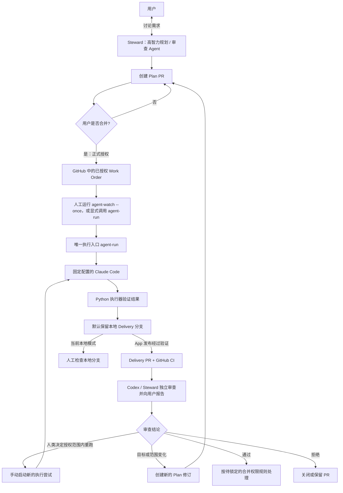

# Agent Delivery Loop

> 一个 GitHub-native、由人类明确授权的 CLI Coding Agent 持续交付闭环。

**English summary:** A GitHub-native, human-authorized delivery loop for CLI coding agents.

> [!IMPORTANT]
> 当前仓库已有第一版 Python 本机 CLI 与最小 CI，但尚未完成真实 Work Order 端到端试运行。可以先做受人工监督的试运行：检查本地交付分支后，由人手动推送并创建 Delivery PR。Codex CLI 已修复，可人工启动 Steward 审查。GitHub App、`main` 保护和无人值守发布仍未验证；**不要把本项目视为生产可用系统**。

## 当前实现状态

**已实现（源码范围）**

- JSON Work Order v1、严格解析器及示例；授权文件必须按 `.agents/work-orders/{task_id}-r{revision}.json` 命名。
- `agent-run`：显式指定已合并到 `main` 的 Plan PR 和其修改的 Work Order；在该 PR merge commit 上读取 Work Order 与 Skill，固定 SHA-256 和代码基线。
- `agent-run` 和 `agent-watch --once` 都要求显式提供 `--model`、`--base-url`、`--effort` 与 `--auth-config`。认证仅从所指定 Claude settings JSON 的 `env` 中读取 `ANTHROPIC_AUTH_TOKEN`、`ANTHROPIC_API_KEY`、`CLAUDE_CODE_OAUTH_TOKEN` 之一；必须恰好出现一个受支持的认证项，且其值是非空字符串。即使其他候选项的值为空，也视为冲突。settings 文件必须是目标仓库外的普通文件，读取后只把所选认证值放入 Worker 环境，不复制配置文件或其余 `env` 字段。
- Claude 配置使用不可变快照；父环境中的旧模型、路由、认证和 effort 设置不会覆盖显式选项。Worker 启动前以不带认证值的普通 `--help` 检查当前 CLI 是否列出所选 `--effort` 级别，不支持时停止。
- 独立 Git worktree、新的 Claude Code Session ID、每次运行独立 HOME；safe/restricted 模式屏蔽用户和项目级自定义项、MCP 与任意代码执行工具，只追加授权的 Delivery Skill。禁用 Session transcript 持久化，只记录 Session ID 与脱敏运行元数据。
- Worker 通过 Claude CLI 的 `--json-schema` 结构化输出逐项报告每个验收条件；只有 CLI 成功、状态为 `complete`、所有条件为 `met` 且没有未完成事项时才允许提交。`blocked`、`incomplete`、格式错误或状态矛盾都会失败关闭，运行记录仅保存脱敏状态和未完成事项，不保存原始会话输出。
- Worker 创建前，先在现有运行记录中持久化并回读验证 `worker_status: start_unconfirmed`，作为“尚未确认安全结束”的门禁；领取任务时检查全部运行记录。Ctrl+C、超时和异常会尝试有界停止 Worker 进程组，但不保证每次都能确认停止。进入创建阶段后，未取得进程句柄也按停止未确认处理，保留 HOME 和门禁；后续状态写入失败或再次取消，启动前记录仍会阻止新任务。只有明确未启动或已确认停止，才可清理 HOME 并写入安全状态。启动登记和停止/HOME 清理关键区短暂延迟 Ctrl+C，取消不会被吞掉后继续交付。记录不可读、格式损坏或缺少安全字段时失败关闭；不自动恢复或清除阻断。
- 本机任务互斥锁、提交前允许路径检查、提交内容和父提交快照、最终提交路径复核、`git diff --check`、本地 Delivery 分支与私有运行记录。执行器使用单次 Git 命令配置屏蔽钩子，不改用户全局配置，也不删除用户钩子。
- `agent-watch --once`：单次扫描已合并 Plan PR；不安装定时任务，不运行守护进程。
- GitHub App 窄权限发布接口；CI 编译源码、运行聚焦回归用例、解析 Work Order schema，并验证示例 Work Order。CI 不会自动检查每张新 Work Order。

**尚未验证**

- 此仓库代码尚未执行一张真实 Plan PR Work Order；Claude CLI 与当前 GLM 路由均没有通过本仓库启动真实 Session。允许先由人检查本地交付分支，再手动推送并创建 Delivery PR；这条手动路径也尚未实际试运行。
- 当前记录的本机 Claude Code CLI 版本为 2.1.288。账号认证有效性、GLM-5.3 路由及 Worker 启动均未验证；没有发起真实模型请求。
- GitHub App 尚未配置；只读检查确认 `main` 未启用 branch protection，且仓库没有 ruleset，因此 `--publish` 不可用。默认只创建本地分支；人工可在检查后自行推送并创建 Delivery PR。
- App 私钥隔离没有进行操作系统级实测；restricted CLI 工具边界不等同于独立 OS 用户或沙箱。
- Claude Code 管理员托管策略可能仍适用，当前执行环境的托管策略尚未审计。
- Work Order 的 `max_budget_usd` 会传入 Claude CLI，但经当前自定义模型端点的实际费用上限语义尚未验证；首次试运行前应按软限制看待。
- `agent-watch` 只做手动 `--once`；无跨主机抢单、自动重试或定时器。
- Codex CLI 安装问题已修复；Codex Steward 审查及自动简报尚无接口实现。Delivery PR 的语义审查需要人工启动 Codex 并报告。
- 不调用模型的临时子进程与故障注入回归覆盖启动登记取消、创建阶段未返回句柄的异常、停止未确认后的写入失败/再次取消、门禁读写故障，以及 HOME 清理时取消不得继续交付。这些验证只覆盖受控替身与本机状态路径；真实 Claude Code CLI 在当前主机与路由下的启动和停止行为尚未验证。Session ID 会记录，但 transcript 不保存；Session 恢复流程尚未设计。

**后续阶段**：真实试运行、GitHub App/仓库规则验证、Issue 进度讨论、Hermes 手机通知、Steward 自动审查，以及跨主机或自动恢复都需另行讨论和验证。

## 为什么要做这个项目

Coding Agent 已经可以完成大量开发工作，但“能够写代码”并不等于“可以长期、无人值守地交付代码”。真正困难的问题包括：

- Agent 从哪里获得经过确认的任务？
- 怎样证明它执行的是用户批准的那个版本？
- 怎样防止任务在执行过程中悄悄扩大范围？
- 怎样让不同触发入口最终遵守同一套规则？
- 怎样在不绑定某个特定 Agent 框架的前提下保留审查、追踪和恢复能力？
- 怎样确保 Agent 只能提交候选成果，而不能自行批准、合并或部署？

Agent Delivery Loop 的第一阶段只解决一个明确目标：

> 将已经讨论清楚并获得人类授权的需求，安全地交给本地 CLI Agent 执行，并通过 GitHub 返回可审查的交付成果。

“主动发现问题并推动项目长期演进”属于后续阶段，不在 v0 范围内。

## 核心原则

1. **GitHub 是事实来源**

   Plan PR 是开工授权的事实来源，Delivery PR 是代码审查入口；运行中的 Session 和脱敏状态保存在权限受限的本机目录。

2. **开工授权与成果审查是两个不同决定**

   - 合并 Plan PR：允许 Agent 开始工作。
   - Delivery PR：由 Codex 等高智力 Steward 审查并向用户发送简报；当前需人工启动审查，何时允许自动合并仍须单独锁定权限规则。

3. **所有触发入口最终调用同一个执行入口**

   无论未来由何种入口触发，都只能请求执行一个已经授权的确定任务引用。当前手动命令形式为：

   ```text
   agent-run --plan-pr <merged-plan-pr> --work-order-path <authorized-work-order.json> \
     --model glm-5.3 --base-url https://open.bigmodel.cn/api/anthropic --effort max \
     --auth-config /path/outside/repository/claude-settings.json
   ```

   `agent-run` 已有实现；执行前会再次核实 PR 已合入 `main`，而不是信任用户传入的 PR 状态。

4. **提示词和 Skill 负责指导，确定性程序负责约束**

   Agent 可以通过 Skill 理解工作方法，但会话参数、工作目录、超时和允许修改范围由执行器约束；GitHub App 写权限与分支保护仍待真实验证。

5. **执行 Agent 是可替换的工作人员，不是任务所有者**

   Agent 可以修改代码并产出摘要；第一版不给它任意 shell/代码执行工具，若验收需要运行命令则必须停下说明。外部执行器负责检查变更范围和提交本地候选分支；Agent 不能修改授权记录或批准自己的成果。

6. **失败应当可见，而不是被自动掩盖**

   模型、供应商或执行环境发生故障时，本次执行应明确失败。v0 不会在同一次运行中偷偷切换模型继续工作。

## v0 工作流程

这里的 **Work Order** 是合并进主分支、可被程序读取的任务授权记录。执行器必须绑定 Plan PR 的 merge commit、Work Order 修订版本和内容摘要，不能在启动时随意读取一个后来被改过的“最新版”。



`agent-watch --once` 与 `agent-run` 已实现为本机 CLI。当前没有定时器；用户手动启动命令才会扫描或执行。合并 Plan PR 只代表任务获得执行资格，不会自动唤醒本机。

这个流程包含两道明确的门：

```text
第一道门：允许开始施工
Plan PR ──用户合并──> Agent 获得执行资格

第二道门：审查施工结果
Delivery PR ──CI + Steward 审查──> 合并决策；代码进入正式分支后也不等于已经部署
```

## 五分钟理解双 PR

- **仓库（Repository）**：项目文件以及完整修改历史。
- **主分支（通常是 `main`）**：当前正式版本。
- **分支（Branch）**：从正式版本分出的一条独立修改线，Agent 可以在其中工作而不立即影响正式版本。
- **提交（Commit）**：一次有编号的修改快照。
- **PR（Pull Request）**：请求审查并合并某条分支的 GitHub 页面。
- **合并（Merge）**：批准 PR，把改动正式纳入目标分支。

“双 PR”不是让 Agent 写两遍代码，而是分开批准两个问题。

### Plan PR：任务授权单

Plan PR 不负责提交最终功能，而是记录 Agent 被允许完成什么工作。它至少应说明：

- 任务目标；
- 明确不做的内容；
- 验收条件；
- 允许修改的目录或文件；
- 执行器和固定运行配置；
- 使用的 Delivery Skill 版本；
- 超时、预算和停止条件；
- 任务所基于的代码版本。

当用户合并 Plan PR 时，代表：

> 我同意 Agent 按照这个精确版本的计划开始工作。

如果目标、验收条件、修改范围或 Skill 版本发生实质变化，应创建新的任务修订版本并重新授权。

### Delivery PR：实际交付物

Delivery PR 包含：

- Agent 实际修改的代码；
- 实际运行过的构建或检查结果；
- 任务执行摘要；
- 偏离计划之处；
- 未解决问题和风险。

Delivery PR 预期由高智力 Agent 审查并向用户返回精简报告；该审查接口目前是人工接入。用户不承担常规代码验收的目标仍在，但当前实现不自动审查或合并，也不能把审查报告当作 GitHub 的合并许可。

## v0 角色

### 用户 / Repository Owner

- 与 Steward 确认需求；
- 合并 Plan PR，授予执行权限；
- 处理 Agent 无法决定的问题；
- 接收 Delivery PR 的简报；网页、多媒体等需要感官判断的任务可直接交互。

### Steward：高智力规划与审查 Agent

- 与用户澄清需求；
- 将谈话整理为可执行的 Work Order；
- 创建或建议 Plan PR；
- 在交付后开启新的独立会话审查 Delivery PR；
- 发现越界、遗漏和风险，并向用户给出精简、直观的结论。

Steward 不能替用户合并 Plan PR。它对 Delivery PR 的审查结论必须绑定精确 head SHA；PR 出现新提交后，旧审查自动失效。它能否触发 Delivery PR 自动合并，须等身份与分支规则验证后另行确定。

### Worker：执行层 Agent

v0 只支持一个固定配置的 Claude Code Worker。它负责：

- 读取已授权的 Work Order；
- 在独立 worktree 和新会话中工作；
- 修改允许范围内的代码；
- 使用本轮受限文件工具完成修改；若验收需要 shell 命令或额外权限则停止；
- 产出可供执行器检查的交付摘要；
- 在无法安全继续时报告 `blocked`。

它不能扩大任务范围、修改授权记录、切换执行模型、直接使用 GitHub App 凭据、合并 PR 或部署到生产环境。

### `agent-watch`：本地任务观察器

`agent-watch --once` 是已实现的单次“门铃”。它按 PR 更新时间降序分页读取关闭 PR，最多检查其中先遇到的 30 个已合并 PR，每页最多 100 个、总计最多 1000 个关闭 PR。若达到 1000 个上限仍未检查满 30 个已合并 PR，命令会报错而不报告“无任务”。

这个排序依据是更新时间，不是合并时间；旧 PR 的后续活动可能改变顺序，因此不能保证覆盖按合并时间最新的 30 个 PR。首次真实 Work Order 试运行应显式指定已合并的 Plan PR 调用 `agent-run`；手动执行路径稳定后，再单独验证 `agent-watch --once`。

- 单次查询 GitHub；
- 找到已经授权但尚未执行的任务；
- 避免重复领取同一个任务；
- 调用唯一入口 `agent-run`。

它不要求公开本机端口，电脑离线期间也不会丢失 GitHub 中的任务。定时调度没有安装，也不是当前实现的一部分。

### `agent-run`：唯一执行入口

`agent-run` 是已实现的确定性执行入口：

- 验证任务和授权状态；
- 固定任务修订版本、代码基线和 Skill 版本；
- 创建隔离的 worktree；
- 启动固定配置的 Claude Code；
- 施加权限、范围、超时和并发限制；
- 收集脱敏运行记录，并将实际 Session ID 与运行关联；
- 验证实际修改范围并提交本地 Delivery 分支；
- 只有显式 `--publish` 且 App 配置、凭据隔离、仓库保护条件被维护者验证后，才尝试创建 Delivery PR。

未来所有入口都只能请求调用它，不能各自实现一套执行逻辑。

### Hermes：尚未实现的可选单向通知器

Hermes 不在当前执行主链中，也不是执行 Agent。未来可考虑让交付系统把状态发送给 Hermes，再由 Hermes 向手机通知用户：

- `REVIEW_READY`：Delivery PR 等待审查；
- `BLOCKED`：执行需要用户处理问题；
- `FAILED`：本次运行失败；
- `COMPLETED`：任务已经结束。

即使未来接入，Hermes 也不应：

- 写入或修改 GitHub；
- 创建、授权、唤醒、重试或取消任务；
- 把手机回复或自然语言转换为本机命令；
- 充当 Worker 修改代码；
- 合并 PR 或部署代码；
- 保存代码仓库的生产密钥。

```text
唯一正式授权输入：用户合并 Plan PR
                     ↓
              本机发现并执行
                     ↓
      （未来可选）状态单向发送给 Hermes → 手机通知
```

Hermes 通知尚未实现。若未来接入，应先只开放输出方向，避免形成第二个任务入口；其他能力需要重新进行架构和安全评审。

## v0 锁定范围

| 项目 | v0 决定 |
| --- | --- |
| 事实来源 | GitHub |
| 仓库与主机 | 一个仓库、一台受信任的本地主机 |
| Worker | 一个固定配置的 Claude Code |
| 本机执行器语言 | Python |
| GitHub 写身份 | 运行器只准备了 GitHub App 接口；尚未配置或验证，不可用于发布 |
| 并发 | 同一时间最多一个任务 |
| 运行隔离 | 每次使用新会话和独立 worktree |
| 当前入口 | 手动调用 `agent-run` 或 `agent-watch --once` |
| 定时入口 | 未安装；本轮不配置 |
| 执行授权 | 用户合并 Plan PR |
| 成果审查 | Codex / Steward 审查并向用户发简报；必要时直接交互 |
| 自动合并 | 目标是减少用户常规验收；权限规则未锁定前不启用 |
| 部署 | v0 不包含部署或 `deployed` 信号 |
| 模型路线 | 一次运行只使用一个固定模型和供应商 |
| Hermes | 后续可选的单向手机通知提案；尚未实现，不含控制或执行能力 |

## v0 非目标

以下能力不会进入第一版主链：

- 通用 MCP 调度中心；
- CCSwitch 自动切换；
- 多模型动态路由；
- 执行过程中的模型故障转移；
- 多机器分布式调度；
- 大规模低成本 Agent 池；
- 未经权限规则验证的自动合并，以及自动部署；
- 让 Hermes 写 GitHub、触发任务或控制本机命令；
- 让 Hermes 充当执行 Agent；
- Agent 自主发现需求并决定项目方向；
- 无人监督的长期自我演进。

它们不是永远不做，而是需要在基础交付闭环稳定以后逐步引入。

## 架构决策记录

已确认的决定与仍在讨论的方案记录在 [ADR 索引](docs/adr/README.md) 中。`accepted` 表示已确定的设计方向，`proposed` 表示尚需确认；这些文档本身不代表执行器已经实现。

从引导实现到首次真实 Work Order 试运行的步骤，见[引导交付说明](docs/bootstrap.md)。

尚未决定的扩展建议单独记录在[后续讨论提案](docs/discussion-backlog.md)，目前包括 GitHub Issue 进度对齐与 CLI Session 归属管理。

## CCSwitch 的位置

CCSwitch 可以继续作为个人 Claude Code 环境中的模型与能力实验工具，但不进入 v0 的自动执行主链。

```text
日常交互环境
└── 可以使用 CCSwitch 探索模型、Skill 和 MCP

无人值守执行环境
└── 使用固定的 Claude Code 配置
    └── 一次运行中不切换模型或供应商
```

未来如果出现多机器、并发执行、统一密钥管理和集中成本统计需求，再评估统一中转服务。

## 当前项目结构

```text
.
├── README.md
├── .github/
│   └── workflows/
│       └── ci.yml
├── .agents/
│   ├── protocol/
│   │   └── work-order.schema.json
│   └── policies/
│       └── delivery-skill/SKILL.md
├── docs/
│   ├── adr/
│   ├── bootstrap.md
│   └── discussion-backlog.md
├── examples/work-orders/WO-2026-001.json
├── pyproject.toml
└── src/agent_delivery_loop/
    ├── cli.py
    ├── claude_worker.py
    ├── git_ops.py
    ├── github.py
    ├── github_app.py
    ├── runner.py
    ├── store.py
    └── work_order.py
```

运行状态和 worktree 存放在仓库之外的 `~/.agent-delivery-loop/`，不会提交到公开仓库。

## 本机手动操作

需要 Python 3.11+、Git、Claude Code CLI 2.1.259+。模型、端点、effort 和 settings 文件由每条命令的显式参数决定；CC Switch 配置保持原样。settings JSON 必须位于目标仓库之外，程序只选择其中 `env` 下恰好一个受支持的 Claude 认证项，不读取父 shell 的认证变量，也不会把认证文件复制到 Worker HOME。CLI 只检查账号配置格式，不证明账号有效或端点可用。Work Order 必须来自目标仓库中已合并的 Plan PR，示例文件本身不构成授权。

```sh
python3 -m venv .venv
. .venv/bin/activate
```

当前源码应在审查并合并后，从准确的完整合并 SHA 构建普通 wheel；不要用 editable install。以干净 checkout 为例：

```sh
(
  set -e
  build_root="$(mktemp -d)"
  build_dir="$build_root/source"
  wheel_dir="$build_root/wheel"
  mkdir "$wheel_dir"
  git worktree add --detach "$build_dir" <reviewed-full-merge-sha>
  cd "$build_dir"
  git rev-parse HEAD
  python -m pip wheel --no-deps --wheel-dir "$wheel_dir" .
  wheel_path="$wheel_dir/agent_delivery_loop-0.1.0-py3-none-any.whl"
  shasum -a 256 "$wheel_path"
  python -m pip install --force-reinstall --no-deps "$wheel_path"
)
```

将 `git rev-parse HEAD` 的完整值记录为安装源码 SHA，将 `shasum` 输出记录为 wheel SHA-256。当前已安装的普通 wheel 不随源码目录更新；本轮不替换它。首次真实试运行须使用审查并合并后的构建。

```sh
agent-delivery validate examples/work-orders/WO-2026-001.json
agent-run --plan-pr https://github.com/OWNER/REPO/pull/123 \
  --work-order-path .agents/work-orders/WO-2026-001-r1.json \
  --model glm-5.3 \
  --base-url https://open.bigmodel.cn/api/anthropic \
  --effort max \
  --auth-config /path/outside/repository/claude-settings.json
```

默认执行成功后只留下本地分支及 worktree，不推送 GitHub。Work Order 需要的检查若超出只读/编辑工具边界，Worker 应停止；CI 在 Delivery PR 阶段执行机械检查，包括源码编译、聚焦回归检查、schema JSON 解析和示例 Work Order 解析。CI 没有扫描每张新 Work Order。首次真实试运行应显式指定已合并的 Plan PR 调用 `agent-run`。后续可用 `agent-watch --once` 手动发现至多一个未处理任务；它按更新时间降序扫描关闭 PR，最多读取 1000 个，并在其中检查先遇到的 30 个已合并 PR。旧 PR 后续活动可能改变排序，因此扫描范围不保证等同于按合并时间最新的 30 个 PR；达到 1000 个上限仍未检查满 30 个已合并 PR 时会报错，不报告“无任务”。

手动运行 `agent-watch --once` 时同样必须提供上述四个配置参数，例如 `agent-watch --once --model glm-5.3 --base-url https://open.bigmodel.cn/api/anthropic --effort max --auth-config /path/outside/repository/claude-settings.json`。执行器完成后先检查命令返回的本地分支和 worktree。确认交付内容后，由人使用自己的 Git/GitHub 身份推送该分支并创建 Delivery PR；个人凭据不传给 Claude Code，也不用于 `--publish`。Codex 审查仍需人工启动。

命令结果给出 `worktree_id`；默认 worktree 位于 `~/.agent-delivery-loop/worktrees/<worktree_id>`，运行记录位于 `~/.agent-delivery-loop/runs/`。可用 `git worktree list` 查看所有本机工作目录；不要把运行记录或完整 Session 内容提交到仓库。

同一状态目录使用主机互斥锁和任务修订锁；领取前会扫描全部运行记录，不能仅凭锁已释放判断 Worker 已停止。启动前的 `start_unconfirmed` 会持续阻断后续任务，直到明确未启动或已确认停止并成功保存安全状态。无法确认停止时保留 HOME，尽可能保存 `cleanup_failed` / `stop_unconfirmed`，不写安全结束时间；若这次更新失败，原有启动门禁仍然有效。Ctrl+C 非零退出；确认进程组停止后才清理 HOME、记录 `cancelled` / `stopped`。旧故障标记仍会阻断，但新运行不再创建重复标记。具体安全状态及故障处理见 [引导交付说明](docs/bootstrap.md#运行记录的安全门禁)。显式重跑只允许在门禁通过后进行，不会绕过未确认运行；不实现自动恢复、清除阻断或重试。运行记录保持私有、脱敏，Session transcript 不保留。

GitHub App 发布入口通过 `--publish` 显式请求，并要求安装可选依赖 `python -m pip install '.[github-app]'`、设置 App ID、安装 ID、仓库外且仅所有者可读的私钥路径，以及维护者完成验证后分别设置 `AGENT_APP_KEY_ISOLATION_VERIFIED=1` 和 `AGENT_MAIN_PROTECTION_VERIFIED=1`。本次只读检查发现当前 `main` 未启用保护且未配置 App；私钥隔离也尚未验证，因此 `--publish` 当前会被拒绝。不要用个人 `gh` Token 代替 App，也不要传递任何 App 凭据给 Claude。

Worker 已确认退出但没有完成任务时，保留交付成果与脱敏运行记录。返修需要另行明确授权，并由人以新 Session 接入；只有目标、验收条件或允许路径发生变化时才要求新 Work Order 修订。Session ID 只用于关联记录，不能恢复完整对话。当前没有续修命令；`agent-run` 从所授权的 Plan merge commit 创建新工作分支，不会接手原 Delivery 分支。若无法确认 Worker 已停止，则继续遵守上方安全门禁，保留 HOME、worktree 和阻断状态，不尝试返修。

失败时命令返回非零并写入脱敏状态；不要手动改写运行记录或直接重用失败 worktree。先检查状态 JSON 和 worktree，再由人决定是否创建新修订。所有变更仍需独立 Codex 审查和 CI；本仓库不自动批准、合并或部署。首次真实 Work Order 试运行尚未发生。

## 安全边界

由于本仓库公开，任何提交到仓库的内容都应被视为公开信息。不得提交：

- API Key、Token 或密码；
- 本机私有路径和个人信息；
- 私有仓库源码或内部业务数据；
- 未脱敏的完整 Agent 会话；
- 可被滥用的生产环境凭据。

外部用户提交的 Issue、评论和 PR 都是不可信输入。只有受信任维护者合并的 Plan PR 才能成为执行资格信号。本地执行器应使用最小权限凭据，且不应持有生产部署权限。Issue 和 PR 评论可用于交流或留痕，但第一版不把它们当作跨主机的原子领取锁。

公开仓库至少应满足以下保护条件：

- `main` 启用分支保护并禁止强制推送；
- 只有受信任的人类账户可以合并 Plan PR；
- 实际验证仓库规则能阻止执行用 GitHub App 合并 Plan PR、修改保护规则或直接推送 `main`；
- `.agents/work-orders/` 与策略目录使用 CODEOWNERS 或等效保护；
- 持久化的本机 self-hosted runner 不直接执行来自 fork 的 `pull_request` 代码。

运行日志应默认只保存完成审查所需的信息，并对凭据、私有路径和个人信息进行脱敏。

GitHub App 的 `Contents:write` 权限也满足合并 PR 接口的权限要求，因此“执行 App 不得越权合并”需要仓库规则实际执行，不能仅靠执行器约定。若 Python 执行器与 Claude Code 使用同一系统用户，也不能仅靠清理环境变量证明 App 私钥已隔离；这两项是正式无人值守启动前的验收条件。详见 [ADR-0002](docs/adr/0002-github-app-unattended-identity.md)。

## 仍需讨论的问题

仍未验证或需在首次真实试运行后再讨论：

- Plan PR 与任务 Issue 的关系；
- `agent-watch` 使用 `launchd`、cron 还是其他本地服务；
- GitHub App 的精确权限、私钥隔离与仓库规则；
- 跨主机领取回执与精确重试规则留到首次真实运行之后；
- 首轮执行的超时和停止边界；自动失败重试暂不实现；
- Session 中断后的恢复策略与 CLI 版本提升流程；
- Worker 允许使用哪些现有 Skills、Hooks 和 MCP；
- 首次真实运行后是否需要扩展现有路径范围检查；
- 哪些检查必须通过才能创建 Delivery PR；
- Steward 的选择和审查输出格式；
- Hermes 通知采用何种传输方式以及需要发送哪些最小信息；
- 公开日志的脱敏和保留期限；
- 开源许可证。

## 当前状态

```text
阶段：最小实现与验证准备
可运行代码：Python CLI、Work Order 解析器、单次 watcher 与最小 CI 已有
生产可用性：不可用；未完成真实 Work Order 试运行
默认执行器：Claude Code CLI，限制为文件工具
许可证：待确定；源码公开但暂未授权复用
```

当前允许在审查本次实现后，挑选一张小而真实的 Work Order 做人工监督试运行，并由人推送本地交付分支、创建 Delivery PR。GitHub App 发布、`main` 保护和无人值守流程仍需另行配置与验证。

## 路线图

### 阶段 0：协议设计

- 冻结 v0 工作流；
- 定义 Work Order 与 Result；
- 确定授权与单机执行的最小停止边界；
- 编写 Delivery Skill 初稿；
- 编写第一份实现提示词。

### 阶段 1：单机交付闭环

- [x] 实现手动 `agent-run` 和 `agent-watch --once`；
- [x] 接入受限配置的 Claude Code CLI；
- [x] 加入 Python 编译、聚焦回归、schema 解析与示例 Work Order 解析 CI；
- [ ] 验证 GitHub App/仓库保护后创建 Delivery PR；
- [ ] 完成首个真实仓库试运行。

### 阶段 2：可靠性与可观测性

- 根据首次真实运行记录再设计跨主机领取和故障恢复；
- [x] 本机并发互斥与允许修改范围检查；
- [x] 脱敏本机 JSON 运行记录；
- [ ] Hermes 手机通知；
- [ ] Skill 稳定版与候选版发布机制。

### 阶段 3：异构执行层

- 将 Codex CLI 接入 Worker 执行层；
- 引入受限的低成本 Worker；
- 增加能力与信任等级；
- 评估集中网关和多主机执行；
- 保持每次运行的模型路线固定。

### 阶段 4：长期项目演进

- 主动发现维护问题；
- 提出而非直接执行改进建议；
- 人类批准长期演进计划；
- 建立防止目标漂移的项目基线与周期复审机制。

## 参与讨论

本项目目前是公开的早期实现与设计实验。欢迎通过 Issue 讨论：

- GitHub-native Agent 协议；
- 人类授权边界；
- CLI Agent 的安全执行；
- 本地轮询与自托管 Runner 的取舍；
- 多 Agent 审查与执行分离；
- 不同 Coding Agent 的最小通用接口。

在首个协议版本冻结以前，请不要假设 README 中的字段和目录已经稳定。

## 许可证

本项目尚未选择许可证。仓库公开可见不等于允许复制、修改或再分发；在 LICENSE 文件加入以前，请将其视为仅供查看和讨论。

## English summary

Agent Delivery Loop is a GitHub-native, human-authorized delivery loop for CLI coding agents. Its local Python runner and manual discovery command are implemented.

The initial version focuses on one problem: turning an already-approved requirement into a reviewable pull request through a fixed local Claude Code worker.

GitHub is the source of truth. Merging a Plan PR authorizes execution; merging a separate Delivery PR accepts the implementation. Agents cannot approve their own work, merge changes, or deploy automatically.

The project has not yet processed a real Work Order. A supervised manual trial can use a locally created delivery branch that a human reviews, pushes, and turns into a Delivery PR. GitHub App publishing, main branch protection, and unattended delivery remain unverified.
